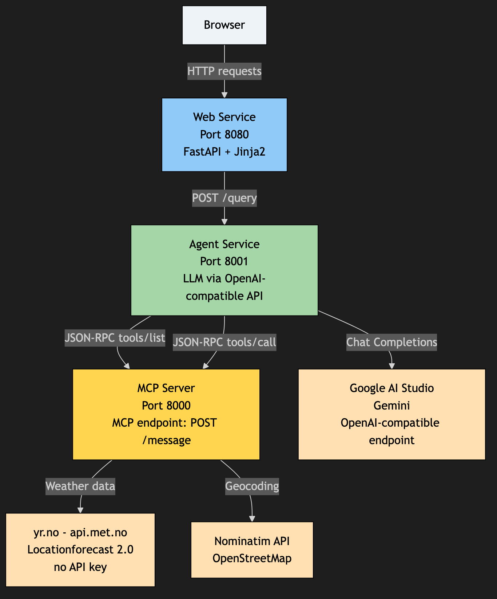
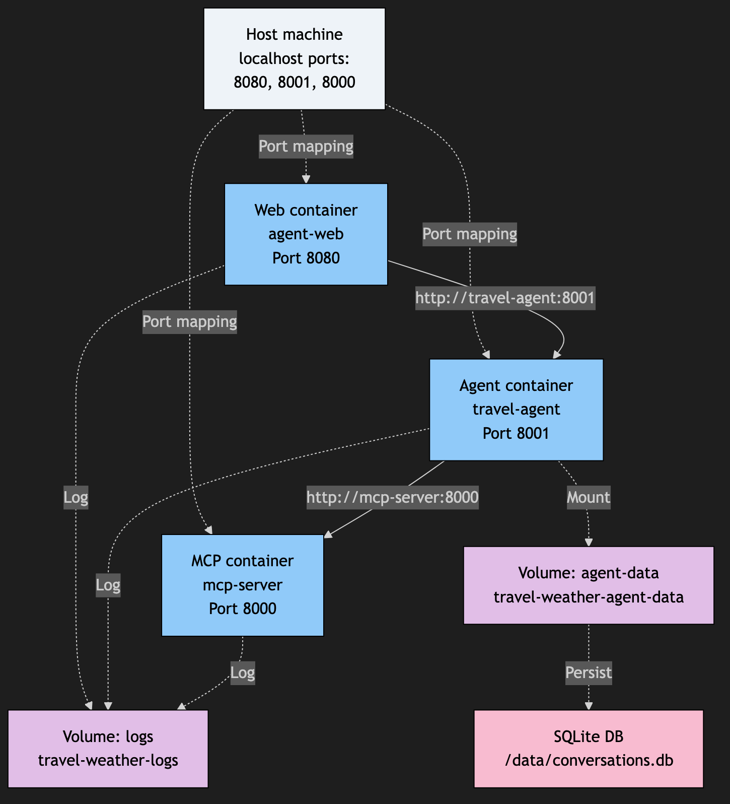
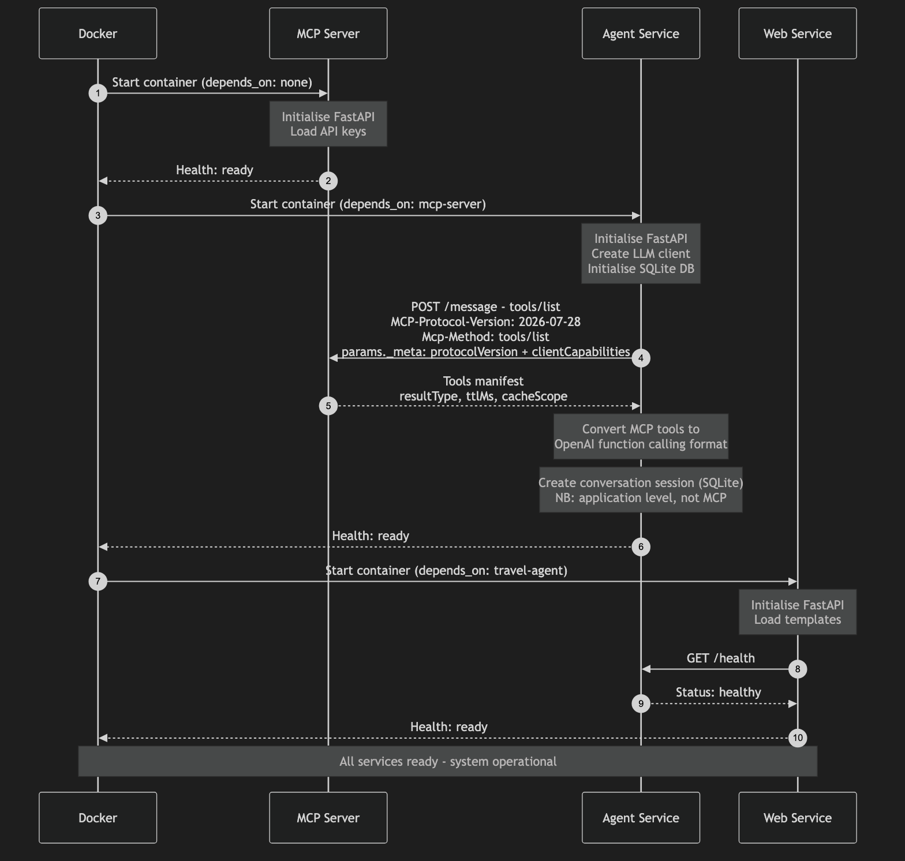
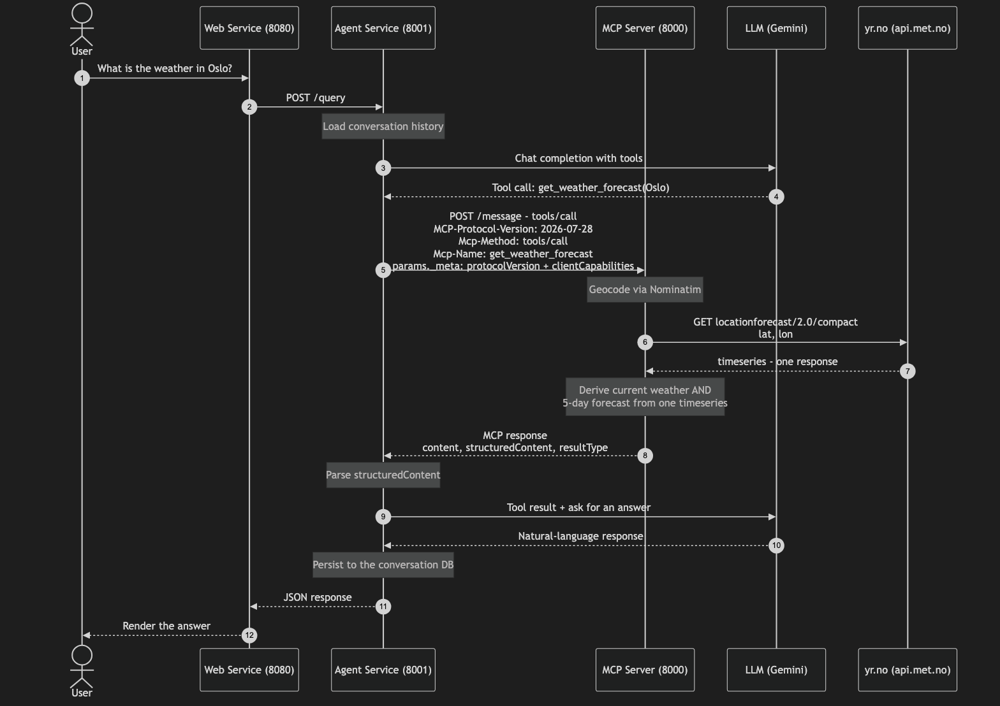

<!--
_class: lead
_color: black _color: black
-->

# Build AI Agents That Actually Do Things
## Hands-on with the Model Context Protocol (MCP)

**Leif Terje Fonnes and Lars Søraas**
*1 September - JavaZone 2026*

### Following MCP specification `2026-07-28`


---
<!--
_color: black _color: black
-->

# Agenda

1. **What MCP is, and why an agent needs it**
2. **Architecture** — three services, one protocol
3. **Setting up** — Codespaces, an API key, and picking a model
4. **What's new in `2026-07-28`** — stateless, `_meta`, headers, status codes
5. **Hands-on** — explore, break it on purpose, build two tools
6. **Summary & resources**

### Two hours. Roughly half of it is hands-on.


---

<!-- _class: lead -->
# What is Model Context Protocol (MCP)?


---
# But first, some context — why agents at all?

<div class="columns">
<div>

## Some problems resist specification

*"Going to Bergen on Friday — what should I pack?"*

- a thousand different wordings
- no endpoint for it
- no sane number of `if`s

</div>
<div>

## Agents absorb the fuzziness

**Reasoning** where the problem is vague.
**Plain code** where it is exact.

A layer in front of deterministic software, not a replacement for it.

</div>
</div>

---
# So what is an agent, exactly?

<div class="columns">
<div>

## An agent is "_something_" that can:
- Understand user requests
- Provide contextual responses
- Learn and adapt over time
- Perform actions via tools
- Fetch real-time data and resources
</div>
<div>

## To achieve this it needs
- Reasoning
  - Plan, make decisions
- Memory
  - Remember, have knowledge
- Access to the real world
  - Sense, feel, act
</div>
</div>

## MCP provides access to tools and data in a standardized way!

---
# Why MCP?

<div class="columns">
<div>

## Tools describe themselves in prose

`description` is plain language, not types and paths — written for a reader that understands language.

That is how the model picks the right tool for a vague request.

</div>
<div>

## Which is what crosses silos

Weather here. News there. Your own systems next door.

Nothing had to agree on a schema. The agent **combines** them — a join nobody coded.

</div>
</div>

### Being a standard protocol makes this *easy*. The natural-language description is what makes it *possible*.

---

# MCP

### A **protocol** for connecting AI applications to external systems

- **Transport**: **stdio** or **Streamable HTTP** — one `POST` endpoint,
  stateless: no handshake, no session

**Three server primitives:**

- **Tools**: actions the model can invoke — *this is what we build today*
- **Resources**: data and documents the client can read
- **Prompts**: reusable prompt templates

#### https://modelcontextprotocol.io/specification/2026-07-28 + https://modelcontextprotocol.io/docs/getting-started/intro


---

# Streamable HTTP

### One endpoint. `POST` only. The reply comes back one of two ways.

```
POST /message   ->   application/json      one JSON-RPC result
                ->   text/event-stream     SSE; the last event is that result
```

- The client says **`Accept: application/json, text/event-stream`** and handles both
- **The server chooses** — streaming is a property of one response, not of the connection
- **Stateless**: no `initialize`, no session id, nothing held open

### `2026-07-28` removed the GET stream — a `GET` on the endpoint is now `405`

---

<!-- _class: lead -->
# Architecture

## How does it all fit together?
### Workshop


---
# System Architecture


## 🌐 **Web Interface**
- Simple HTML frontend for testing
- Real-time interaction with agent


## 🤖 **AI Agent**
- Talks to any OpenAI-compatible LLM API
- Calls MCP tools when needed
- Handles "conversation memory"

## 🖥️ **MCP Server**
- Hosts tools for the agent
- Exposes tools via MCP standard
- Handles external API and resource integration



---
# Deployment

- Each component runs in its own Docker container
- Host exposes 8080 (Web) and 8001 (Agent API), and 8000 (MCP Server API)
- Logs and data are shared via volumes



---
# Data Flow

## Startup



---
# Data Flow

## Request



---

<!-- _class: lead -->
# Setting Up the Development Environment for the Workshop


---

# Development Environment for the Workshop

## 1. Log in to your GitHub account
## 2. Create a *fork* of https://github.com/zral/mcp-lab-jz26-final
## 3. Check **Copy the main branch only**
## 4. Select **Code / Codespaces / Create Codespace on...**
## 5. Copy **.env.example** to **.env** in Codespace
## You now have a ready-to-go development environment!

---

# API Key for Gemini
## You need this to access an LLM (weather data uses yr.no - no key required)
<p></p>

## 1. Go to https://aistudio.google.com/apikey
## 2. Sign in with the Google account you already have
## 3. **Create API key** - under a minute, no credit card
## 4. Open **.env** in Codespaces and paste it into ```OPENAI_API_KEY```
## 5. Weather data is fetched from yr.no (api.met.no) - no API key required

### Free tier: 500 requests/day, 15/minute, 1M context window

---

# Pick the Boring Model

## We measured instead of guessing. 5 calls each, same prompt, same tool.

| Model | Succeeded | Called the tool | Median |
| --- | --- | --- | --- |
| `gemini-3.5-flash-lite` | **5/5** | **5/5** | **598 ms** |
| `gemini-3.1-flash-lite` | **5/5** | **5/5** | 600 ms |
| `gemini-flash-lite-latest` | **5/5** | **5/5** | 615 ms |
| `gemini-flash-latest` | 4/5 | 4/5 | 3 112 ms |
| `gemini-3.7-flash` | 3/5 | 3/5 | 4 516 ms |

### The newest model was the worst choice

`gemini-3.7-flash` — the one the docs push for "agentic workflows" — failed two of five calls with `429` and `503`, and was **7× slower**. 
Newest means *most contended*, and on a free tier you feel that first.

Free-tier quota says the same: **lite gets 500 requests/day, plain Flash gets 20.**

### You are not building a benchmark. You are building a thing that has to work.

---

<!-- _class: lead -->
# Before we get started - recap and clarifications


---

# How `2026-07-28` Works

## The big idea: **MCP is stateless**

> "The Model Context Protocol (MCP) is a stateless protocol: all the information
> needed to process a request is contained in the request itself."

<div class="columns">
<div>

### Every request carries
- `_meta` — protocol version and client capabilities
- The same values mirrored into HTTP headers
- Everything needed to serve it: nothing is remembered

</div>
<div>

### Every server must
- Implement `server/discover`
- Return `resultType` on every result
- Add `ttlMs` / `cacheScope` to list results
- Validate the `Origin` header

</div>
</div>

### No handshake, no session. If you find `initialize` in a tutorial, it predates the spec.

---

# What a Request Looks Like

### Four headers, and `_meta` in the body — both new in this revision

```http
POST /message
Content-Type: application/json
Accept: application/json, text/event-stream
MCP-Protocol-Version: 2026-07-28
Mcp-Method: tools/call
Mcp-Name: get_weather_forecast

{ "jsonrpc": "2.0", "id": 1, "method": "tools/call",
  "params": { "name": "get_weather_forecast",
              "arguments": { "location": "Oslo, Norway" },
              "_meta": {
                "io.modelcontextprotocol/protocolVersion": "2026-07-28",
                "io.modelcontextprotocol/clientCapabilities": {},
                "io.modelcontextprotocol/clientInfo": {
                  "name": "travel-agent", "version": "1.0.0" }
              } } }
```

### The headers mirror the body. Disagree, and you get `-32020` with HTTP 400.

---

# Why Both Header *and* Body?

## The body is the truth. The headers are mirrors.

Headers exist so **intermediaries** — load balancers, gateways, observability tooling — can route and inspect **without parsing JSON**.

### The server **MUST** check that the two agree

If they disagree, you have an attack surface: a gateway that waves through

```http
Mcp-Name: read_document
```

while the body actually says

```json
{ "name": "delete_everything" }
```

### → `400 Bad Request` with error code `-32020` (`HeaderMismatch`)

**Note:** `Mcp-Name` only applies to methods that have a name parameter
(`tools/call`, `resources/read`, `prompts/get`). `tools/list` has none.

---

# Error Codes Are Now Tied to HTTP Status Codes

## This is the biggest change to get used to in practice

Before, the server always answered `200 OK` and put the error in the body.

| Code | Name | HTTP | When |
| --- | --- | --- | --- |
| `-32700` | Parse error | 400 | invalid JSON |
| `-32600` | Invalid Request | 400 | not valid JSON-RPC 2.0 |
| `-32601` | Method not found | **404** | unknown method |
| `-32602` | Invalid params | 400 | missing `_meta` or parameters |
| `-32020` | HeaderMismatch | 400 | header disagrees with the body |
| `-32022` | UnsupportedProtocolVersion | 400 | we don't speak that version |
| `1001` | Origin not allowed | 403 | invalid `Origin` (our own code) |

### Why `404` for an unknown method?

So a client can tell a **modern server** (404 *with* a JSON-RPC body) from a **legacy HTTP+SSE server** that doesn't host the endpoint at all (404 without one). **Without** the status code the two are indistinguishable.

---

# `server/discover` — Everything in One Call

Servers **MUST** implement it. One request returns versions, capabilities and identity.

```json
{ "jsonrpc": "2.0", "id": "discover-1", "method": "server/discover",
  "params": { "_meta": { "io.modelcontextprotocol/protocolVersion": "2026-07-28",
                         "io.modelcontextprotocol/clientCapabilities": {} } } }
```

```json
{ "jsonrpc": "2.0", "id": "discover-1",
  "result": {
    "resultType": "complete",
    "supportedVersions": ["2026-07-28"],
    "capabilities": { "tools": {} },
    "_meta": { "io.modelcontextprotocol/serverInfo":
               { "name": "mcp-travel-weather", "version": "2.0.0" } },
    "instructions": "Weather forecasts for any location, via yr.no.",
    "ttlMs": 3600000,
    "cacheScope": "public"
  } }
```

- **`resultType`** — `"complete"` or `"input_required"`. Required on **every** result.
- **`ttlMs` / `cacheScope`** — how long the client may cache, and who may cache it.

---

# MRTR: The New Mental Model

## What happens when the *server* needs something from the *client*?

Sampling, elicitation, asking for roots — and no SSE stream to send it down.

### Now the server returns an unfinished result

```json
{ "resultType": "input_required",
  "inputRequests": [ { "method": "elicitation/create", "...": "..." } ] }
```

The client gathers the input and **retries the original request**, carrying `inputResponses`.

<div class="columns">
<div>

### Why it's better
- No server-initiated requests to route
- Works identically on stdio and HTTP
- Survives a dropped connection
- Retry is just another stateless POST

</div>
<div>

### Why `resultType` matters
Every result declares what it is, so a client that only handles `"complete"` knows at once when it got something else. 
Absent `resultType` → treat as `"complete"`.

**Not implemented here** — but recognise it when you meet it.

</div>
</div>

---

# Security: `Origin` and DNS Rebinding

## Servers **MUST** validate `Origin`. This is not a formality.

<div class="columns">
<div>

### The attack

- You open a page on `evil.example.com`
- Its DNS record has a one-second TTL, and
  re-resolves to `127.0.0.1`
- The browser now believes the page's origin
  is on *your* machine
- It posts to your MCP server on `localhost:8000`
- Every tool you exposed is reachable from a
  web page

**Relevant right now:** this workshop runs in
Codespaces with forwarded ports.

</div>
<div>

```python
# services/mcp-server/mcp_protocol.py
def is_origin_allowed(origin: str | None) -> bool:
    if origin is None:
        return True   # curl and the agent send none
    ...               # localhost, *.app.github.dev
```

### Why is "no `Origin`" allowed?

- The **browser** sets it — and the browser is
  the attack path
- Server-to-server traffic never sends one
- Absent is fine; *present and untrusted* is `403`
- Configure with `MCP_ALLOWED_ORIGINS` in `.env`

</div>
</div>

---

<!-- _class: lead -->
# Hands-on: Exploring the Code


---


# Project Structure

```
./
├── docker-compose.yml        # 🐳 Container orchestration (use: docker compose)
├── .env.example              # 🔐 Environment variables (copy to .env)
└── services/
    ├── mcp-server/          # 🔧 MCP Server
    │   ├── app.py           # ⭐ The MCP endpoint + tools
    │   ├── mcp_protocol.py  # 🛡️ _meta, headers, error/status codes
    │   ├── Dockerfile       # 🐳 Container image
    │   └── requirements.txt
    ├── agent/               # 🤖 AI Agent
    │   ├── app.py           # ⭐ OpenAI & MCP Server integration
    │   ├── conversation_memory.py       # 🧠 Conversation memory
    │   ├── Dockerfile
    │   └── requirements.txt
    ├── web/                  # 🌐 Frontend
    │   ├── app.py            # ⭐ Simple web server
    │   ├── Dockerfile
    │   └── templates/
    ├── mcp-sdk-client/       # ✅ Compliance test
    │   ├── test_mcp_sdk.py
    │   ├── Dockerfile
    │   └── requirements.txt
    └── shared/               # 📦 Shared resources
```

---

# Agent - Fetching Tools from MCP Server

<div style="font-size: small;">

```python
# services/agent/app.py

PROTOCOL_VERSION = "2026-07-28"

def build_request(method: str, params: dict | None = None, name: str | None = None):
    """Every MCP request needs _meta in the body and mirrored headers."""
    params = dict(params or {})
    params["_meta"] = {
        "io.modelcontextprotocol/protocolVersion": PROTOCOL_VERSION,
        "io.modelcontextprotocol/clientCapabilities": {},
        "io.modelcontextprotocol/clientInfo": {"name": "travel-agent", "version": "1.0.0"},
    }
    headers = {
        "Accept": "application/json, text/event-stream",
        "MCP-Protocol-Version": PROTOCOL_VERSION,
        "Mcp-Method": method,
    }
    if name:                      # only for tools/call, resources/read, prompts/get
        headers["Mcp-Name"] = name
    return {"jsonrpc": "2.0", "id": 1, "method": method, "params": params}, headers

async def load_tools_from_mcp_server(self):
    body, headers = build_request("tools/list")
    response = await self.http_client.post(
        f"{self.mcp_server_url}/message", json=body, headers=headers)
    result = response.json()["result"]

    # Convert from MCP format to OpenAI function calling format
    for tool in result.get("tools", []):
        self.tools.append({
            "type": "function",
            "function": {
                "name": tool["name"],
                "description": tool["description"],
                "parameters": tool["inputSchema"],
            },
        })
```

</div>

---
# MCP Server - Tools Manifest

```json
{
  "tools": [
    {
      "name": "get_weather_forecast",
      "title": "Weather Forecast Provider",
      "description": "Fetch weather forecast for a destination...",
      "inputSchema": {
        "$schema": "https://json-schema.org/draft/2020-12/schema",
        "type": "object",
        "properties": {
          "location": {
            "type": "string",
            "description": "Name of city or location"
          }
        },
        "required": ["location"],
        "additionalProperties": false
      },
      "outputSchema": {
        "$schema": "https://json-schema.org/draft/2020-12/schema",
        "type": "object",
        "properties": {
          "location": { "type": "object" },
          "current": { "type": "object" },
          "forecast": { "type": "array" }
        }
      }
    }
  ]
}
```

---

# 🔄 The MCP Endpoint

<div class="columns">
<div>

### Server: validate, then route

```python
@app.post("/message")
async def handle_jsonrpc(request: Request):
    # 1. Origin, before anything else
    mcp_protocol.validate_origin(
        request.headers.get("origin"))

    # 2. parse the JSON-RPC envelope
    payload = await request.json()

    # 3. _meta + mirrored headers. Raises
    #    with the right code AND status.
    req = mcp_protocol.validate_request(
        method=payload["method"],
        params=payload.get("params"),
        headers=request.headers,
        request_id=payload["id"])

    # 4. route
    if req.method == "tools/list":
        return jsonrpc_result(
            payload["id"],
            await handle_tools_list())

    raise mcp_protocol.method_not_found(
        req.method, SUPPORTED_METHODS)   # 404
```

</div>
<div>

### Client: body and headers together

```python
body, headers = build_mcp_request(
    "tools/call",
    {"name": "get_weather_forecast",
     "arguments": {"location": "Oslo"}},
)

response = await http_client.post(
    "/message", json=body, headers=headers)

result = parse_mcp_response(response)["result"]
```

### One function builds both
`build_mcp_request()` adds `params._meta` **and** the
four headers that mirror it. Hand-assembling a body
is how you forget `_meta` and lose ten minutes to a `400`.

### `parse_mcp_response()` handles JSON *and* SSE
A conforming server may answer with either.
The client **MUST** cope with both.

</div>
</div>

---

# 🛡️ `mcp_protocol.py` — the Doorman

<div class="columns">
<div>

## Validation order is deliberate

```python
# 1. _meta fields        -> -32602, 400
# 2. Headers mirror body -> -32020, 400
# 3. Version supported   -> -32022, 400
```

**The body is the truth**, so we check it is complete first.

Swap steps 1 and 2, and a client that forgot `_meta` gets told "header mismatch" against a value that doesn't exist — a useless error message.

</div>
<div>

## Two details that bite

### `Origin` may be absent
curl and the agent send none. It's the **browser** that sets `Origin`, and the browser is what the attack goes through.
Absent is fine; *present and wrong* is `403`.

### Header values must be plain ASCII
A tool name with `æ`, `ø` or `å` is wrapped by the client and
**MUST** be decoded by the server before comparison:

```http
Mcp-Name: =?base64?VHJvbXPDuA==?=
```

</div>
</div>

---

<!-- _class: lead -->
# Hands-on: Building Tools


---

# Lab Exercise 1: Explore Existing Tools

## Examine the weather tool and the MCP architecture

<div class="columns">
<div>

### Run these

```bash
docker compose up -d

make curl-discover   # versions, capabilities
make curl-list       # what tools exist?
make curl-weather    # weather for Oslo
make curl-agent      # through the agent
```

The `make` targets set the four required headers for you — that is the whole reason they exist.

</div>
<div>

### What `make curl-list` actually runs

```bash
curl -s -X POST localhost:8000/message \
  -H "Content-Type: application/json" \
  -H "Accept: application/json, text/event-stream" \
  -H "MCP-Protocol-Version: 2026-07-28" \
  -H "Mcp-Method: tools/list" \
  -d '{...,"params":{"_meta":{...}}}'
```

</div>
</div>

### Testing by hand means building the headers yourself — which is what `helper/mcp-curl` is for.

---

# Lab Exercise 1.5: Break It on Purpose

## The fastest way to understand the new rules is to violate them

<div class="columns">
<div>

```bash
make curl-mismatch   # header disagrees with body
make curl-nometa     # no _meta in params
make curl-badversion # a version we don't speak
make curl-unknown    # a method that doesn't exist
```

### What you should see

| Command | HTTP | Error code |
| --- | --- | --- |
| `curl-mismatch` | `400` | `-32020` HeaderMismatch |
| `curl-nometa` | `400` | `-32602` Invalid params |
| `curl-badversion` | `400` | `-32022` + `data.supported` |
| `curl-unknown` | `404` | `-32601` Method not found |

</div>
<div>

### Try this too

```bash
curl -i -X POST "http://localhost:8000/message" \
  -H "Origin: https://evil.example.com" ...
# -> 403, untrusted origin
```

**Look at `data.supported` in the `-32022` response** — that is how a client discovers what to retry with, without a handshake.

</div>
</div>

---

# Lab Exercise 2: Add a New Tool - Random Fact

*Written out in `helper/lab2-exercise.md` — work at your own pace. Solution in `helper/lab2-solution.md` (ROT13).*

### Step 1: Add fact endpoint to MCP Server

<div style="font-size: small;">

```python
# In services/mcp-server/app.py

async def get_random_fact(category: str = "general") -> Dict[str, Any]:
    """Get a random interesting fact."""
    try:
        facts = {
            "general": ["Honeybees produce food eaten by humans.",
                       "Bananas are berries, but strawberries are not."],
            "space": ["A day on Venus is longer than its year.",
                     "Saturn would float in water."]
        }

        import random
        fact = random.choice(facts.get(category, facts["general"]))

        result = {
            "category": category,
            "fact": fact,
            "timestamp": datetime.now().isoformat()
        }

        return result

    except Exception as e:
        logger.error(f"Fact retrieval error: {e}")
        return {"error": f"Could not retrieve fact: {str(e)}"}
```
</div>

---

# Lab Exercise 2: Update Tools Manifest

### Step 2: paste a new entry into the `tools` list in `handle_tools_list()`

<div class="columns">
<div>

```python
{
    "name": "get_random_fact",
    "title": "Random Fact Provider",
    "description": "Get a random fact",
    "inputSchema": {
        "$schema": "https://json-schema.org/"
                   "draft/2020-12/schema",
        "type": "object",
        "properties": {
            "category": {
                "type": "string",
                "enum": ["general", "space"],
            }
        },
        "required": ["category"],
        "additionalProperties": False,
    },
},
```

The weather entry already ends with a comma, so this pastes in cleanly.

</div>
<div>

### The `return` already has what the revision needs

```python
return {
    "resultType": "complete",
    "tools": tools,
    "ttlMs": 300_000,
    "cacheScope": "public",
}
```

`tools/list` **is** cacheable, so it carries `ttlMs` and `cacheScope`.
`tools/call` is not, and carries neither.

### No `endpoint`, no `method`
One server, one endpoint. There is nothing to route.

### The pattern survived the revision
Adding a tool is otherwise exactly what it was.

</div>
</div>

---
# Lab Exercise 2: Handle Tool Calls

### Step 3: Add routing in handle_tools_call()

```python
# In handle_tools_call(), add:

elif tool_name == "get_random_fact":
    category = arguments.get("category", "general")

    result = await get_random_fact(category)

    if "error" in result:
        return {
            "resultType": "complete",
            "content": [{"type": "text", "text": json.dumps(result, ensure_ascii=False)}],
            "isError": True
        }

    return {
        "resultType": "complete",
        "content": [{"type": "text", "text": json.dumps(result, ensure_ascii=False, indent=2)}],
        "structuredContent": result,
        "isError": False
    }
```

### `resultType` is required on **every** result — including the error path
`tools/call` results are not cacheable, so no `ttlMs` or `cacheScope` here - `tools/list` needs both.

---

# Lab Exercise 2: Test the New Tool

### Step 4: Compliance Testing

```bash
# Rebuild (agent fetches tools at startup)
docker compose build mcp-server travel-agent
docker compose up -d

make curl-list          # both tools should now be listed
make curl-fact          # tools/call for get_random_fact
make curl-fact-agent    # the same, through the agent

# Third-party validation with the official SDK
make test-compliance
```

### Calling the tool by hand? Remember `Mcp-Name`

```bash
curl -s -X POST "http://localhost:8000/message" \
  -H "Content-Type: application/json" \
  -H "MCP-Protocol-Version: 2026-07-28" \
  -H "Mcp-Method: tools/call" \
  -H "Mcp-Name: get_random_fact" \
  -d '{"jsonrpc":"2.0","id":2,"method":"tools/call","params":{
       "name":"get_random_fact","arguments":{"category":"space"},
       "_meta":{"io.modelcontextprotocol/protocolVersion":"2026-07-28",
                "io.modelcontextprotocol/clientCapabilities":{}}}}' | python3 -m json.tool
```

Get `Mcp-Name` wrong and you get `400` / `-32020` — not a tool error. **That's the point.**

---

# Lab Exercise 2.5: Validation - Multiple Tools Together

**Test that the agent can use both tools in the same query:**

```bash
curl -X POST "http://localhost:8001/query" \
  -H "Content-Type: application/json" \
  -d '{"query": "What is the weather in Oslo and tell me a fact about space"}'
```

The agent should now automatically:
1. Fetch weather data for Oslo
2. Fetch a fact about space
3. Combine the answers into one response

---

# Lab Exercise 3: A Real API

<div class="columns">
<div>

### Use everything you have learned to add a news tool

- Full brief in **`helper/lab3-exercise.md`** — solution in `helper/lab3-solution.md` (ROT13)
- Add a manifest entry and a routing branch
- **No API key** — Google News RSS is open to anyone
- Test with `make curl-news` and `make curl-news-agent`

**`resultType` on every return path**, including the error ones.

The source answers **XML, not JSON**. The MCP envelope is yours to build whatever the upstream speaks.

The tool returns plain data with an `error` key on failure — never an MCP result. That shape belongs in the routing branch.

</div>
<div>

```python
async def get_news(topic: str) -> Dict[str, Any]:
    """Recent news from Google News RSS - no API key."""
    try:
        async with httpx.AsyncClient() as client:
            r = await client.get(
                "https://news.google.com/rss/search",
                params={"q": topic, "hl": "en", "gl": "US",
                        "ceid": "US:en"},
                timeout=10.0, follow_redirects=True,
            )
            r.raise_for_status()

        root = ET.fromstring(r.content)
        articles = [
            {"title": i.findtext("title"),
             "url": i.findtext("link"),
             # RFC-822 -> ISO-8601, locale-independently
             "published": _to_iso(i.findtext("pubDate"))}
            for i in root.findall(".//item")[:5]
        ]
        return {"topic": topic, "count": len(articles),
                "articles": articles}

    except ET.ParseError as e:
        return {"error": f"Not XML: {e}"}
    except httpx.HTTPError as e:
        return {"error": f"Unreachable: {e}"}
```

</div>
</div>

---

# Lab Exercise 3: Routing, and Four Ways to Fail

<div class="columns">
<div>

### Route it in `handle_tools_call()`

```python
elif tool_name == "get_news":
    result = await get_news(arguments["topic"],
                            arguments.get("language", "en"))
    if "error" in result:
        return {"resultType": "complete", "isError": True,
                "content": [{"type": "text", "text": result["error"]}]}

    lines = "\n".join(f"- {a['title']}\n  {a['url']}"
                      for a in result["articles"])
    return {
        "resultType": "complete",
        "content": [{"type": "text", "text": lines}],
        "structuredContent": result,
        "isError": False,
    }
```

### And declare it in `handle_tools_list()`

```python
{
    "name": "get_news",
    "description": "Fetch latest news about a topic",
    "inputSchema": {
        "type": "object",
        "properties": {
            "topic": {"type": "string", "description": "Topic to search for"},
            "language": {"type": "string", "description": "Language code (e.g. 'no', 'en')"}
        },
        "required": ["topic"]
    }
}
```

</div>
<div>

### This one can actually fail

| Situation | Surfaces as |
| --- | --- |
| Unreachable, or a timeout | `isError: true` |
| Not XML — a consent page | `isError: true` |
| Unsupported language | `isError: true` |
| **Zero articles found** | **`isError: false`, `count: 0`** |
| Tool name does not exist | `-32602`, HTTP 400 |

**Zero articles is not an error** — a search that matched nothing is a tool that worked. Only the last row is a protocol error.

</div>
</div>

---

<!-- _class: lead -->
# 🐳 Deployment & Test

---

# Docker Compose Commands

## Development Workflow

```bash
# Start from scratch
docker compose up --build

# Stop everything
docker compose down

# Rebuild a specific service
docker compose build mcp-server

# View logs
docker compose logs -f travel-agent

# Check health
curl http://localhost:8000/health
```

---

# Tips - Debugging

<div class="columns">
<div>

### 🔴 Container won't start
```bash
docker compose logs service-name
```

### 🔴 API calls failing
```bash
docker compose exec travel-agent env | grep API
```

### 🔴 Tool not recognized
```bash
curl http://localhost:8001/health
```

</div>
<div>

### 🔴 Everything returns `400`
New in this revision. **Read the error code in the body:**
`-32602` means you forgot `_meta`, 
`-32020` means a header disagrees with it.
```bash
docker compose logs mcp-server | grep Rejected
```

### 🔴 `404` on a method you know exists
Check the spelling in **both** `Mcp-Method` and the body.
And remember: `404` *is* the correct answer for an unknown method now.

</div>
</div>

---

<!-- _class: lead -->
# Summary


---

# What You Have Learned

<div class="columns" >
<div>

## 🧠 **Concepts**
- Model Context Protocol fundamentals
- **Why a protocol goes stateless** — and what it costs
- Per-request `_meta` and mirrored headers
- Dynamic tool discovery and loading
- AI agent architecture patterns

## 🚀 **Best Practices**
- Error codes paired with HTTP status codes
- Validating that headers agree with the body
- `Origin` validation against DNS rebinding
- Caching hints: `ttlMs` and `cacheScope`
</div>
<div>

## 🛠️ **Practical Skills**
- Building MCP-compatible tools
- Integrating external APIs securely
- Docker containerization and docker compose orchestration
- Testing strategies, including protocol-level tests
- Conversation memory in a stateless protocol

</div>
</div>

### The one-line takeaway
**Everything the server needs to answer is in the request you just sent.**

---

# Take It Further

Four exercises to do after the workshop. The repo has everything you need.

<div class="columns">
<div>

### 1. Improve the weather tool
Add UV index, air quality, sunrise and sunset. **yr.no already returns all of it** in the same response you are parsing — no new API, no key.

### 2. A calculator tool
Basic arithmetic, expressions, step-by-step answers. The smallest possible second tool, good for confirming the pattern stuck.

</div>
<div>

### 3. Memory-enabled chat
Remember favourite cities and units across sessions.
Start in `conversation_memory.py`.

### 4. Orchestration
Chain tools: weather → attractions → calendar → summary.
This is where agents get genuinely useful, and genuinely hard.

</div>
</div>

### And the one that teaches the most
Point this agent at **someone else's MCP server**. 
That is when you find out whether your client really handles both JSON and SSE responses.

---

# Resources

## 📖 **The `2026-07-28` Specification**
- [Overview and error codes](https://modelcontextprotocol.io/specification/2026-07-28/basic/index)
- [Streamable HTTP — headers and validation](https://modelcontextprotocol.io/specification/2026-07-28/basic/transports/streamable-http)
- [server/discover](https://modelcontextprotocol.io/specification/2026-07-28/server/discover)
- [Caching — `ttlMs` and `cacheScope`](https://modelcontextprotocol.io/specification/2026-07-28/server/utilities/caching)
- [Changelog — what changed and why](https://modelcontextprotocol.io/specification/2026-07-28/changelog)

## 🛠️ **Tools & Libraries**
- [Python SDK `mcp` 2.0.0](https://pypi.org/project/mcp/) — reworked for this revision
- [FastAPI Documentation](https://fastapi.tiangolo.com/)
- [HTTPX for Async HTTP](https://www.python-httpx.org/)

---

<!-- _class: lead -->
# Questions & Discussion

## Thank you!

**Leif Terje Fonnes**
leffen@gmail.com
github.com/leffen

**Lars Søraas**
lsoraas@gmail.com
github.com/zral


